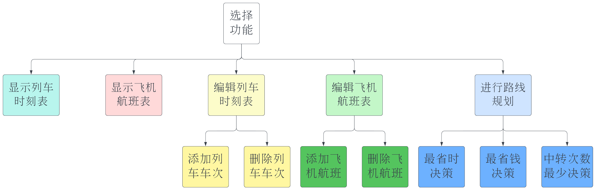

# 整体构想

**详细的数据结构和各主要函数的定义已经在头文件[NationalTrafficConsult.h](NationalTrafficConsult.h)中实现。**

- 表的显示（lxy）
- 表的编辑（hk）
- 路线决策（zyj）

不涉及经停车次，所有车次都是直达。在相同车站之间会有多趟不同时间、票价的车次及航班。

# 数据结构

- 时间的规整格式 `Time`
- 城市交通图 `CityMap`
  - 表结点 `NodeLink`
  - 车次/航班信息 `Info`

# 功能



## 执行流程

- 选择功能 `main()`
  - 显示列车时刻表 `ShowTrainTable()`
  - 显示飞机航班表 `ShowFlightTable()`
  - 编辑列车时刻表 `EditTrain()`
    - 添加列车车次 `AddTrain()`
    - 删除列车车次 `DelTrain()`
  - 编辑飞机航班表 `EditFlight()`
    - 添加飞机航班 `AddFlight()`
    - 删除飞机航班 `DelFlight()`
  - 进行路线规划   `Decision()`
    - 最省时决策      `LeastDurationTime()`
    - 最省钱决策      `LeastCost()`
    - 中转次数最少决策 `LeastExchange()`

# 相关文件

## 代码文件

- NationalTrafficConsult.h，头文件
- NationalTrafficConsult.c，主流程
  - Show.c，显示车次表/航班表（lxy）
  - Edit.c，编辑车次表/航班表（hk）
  - Decision.c，进行路线规划（zyj）

## 数据文件

- TrainTable.txt，保存列车时刻表
- FlightTable.txt，保存飞机航班图

# 输入规范

- 文件输入
  
  每行代表一趟车次/航班，内容为：
  
  ```
  编号 起始站 终点站 起始时间 到达时间 时长 票价
  ```

  这里不同栏目中间最好不要直接加空格，而是以`%-Ns`的格式来实现栏目的左对齐。
- 用户输入
  可以参考Edit.c和Decision.c中的注释

# 其它

- 输入：对交通图、列车时刻表和飞机航班表的编辑，提供两种输入方式，键盘输入和文件输入。