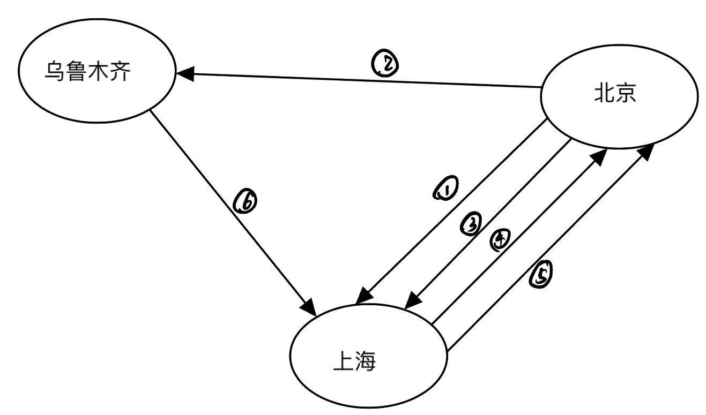
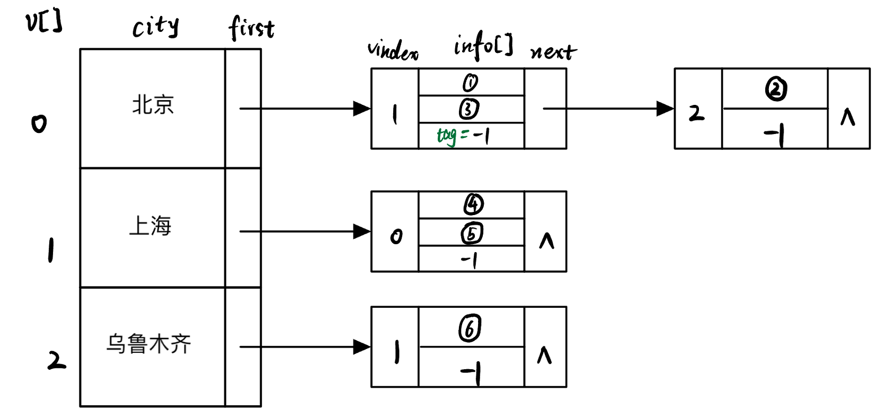

写了一组测试数据，放在TestData.c的函数`TestData()`中了，如果需要的话可以随时取用、扩充。

该函数返回值为一张图，下面是这张图的示意：

①②③……代表某一趟车次/航班，如下表所示：

|序号|编号|始发站|终到站|出发时间|到达时间|时长(分钟)|票价(元)|
|:--|:--|:--|:--|:--|:--|:--|:--|
|①|T000101|北京|上海|10: 00|15: 00|300|350.00|
|②|T000201|北京|乌鲁木齐|10: 00|19: 00|540|750.00|
|③|F000101|北京|上海|10: 00|12: 00|120|550.00|
|④|T010001|上海|北京|11: 00|16: 00|300|350.50|
|⑤|F010001|上海|北京|11: 00|13: 00|120|550.72|
|⑥|F020101|乌鲁木齐|上海|13: 00|23: 30|630|860.00|

对应CMap数据结构如下图所示：（`tag == -1`表示info[]数组的结尾，也就是车次/航班序列结束的标志）

