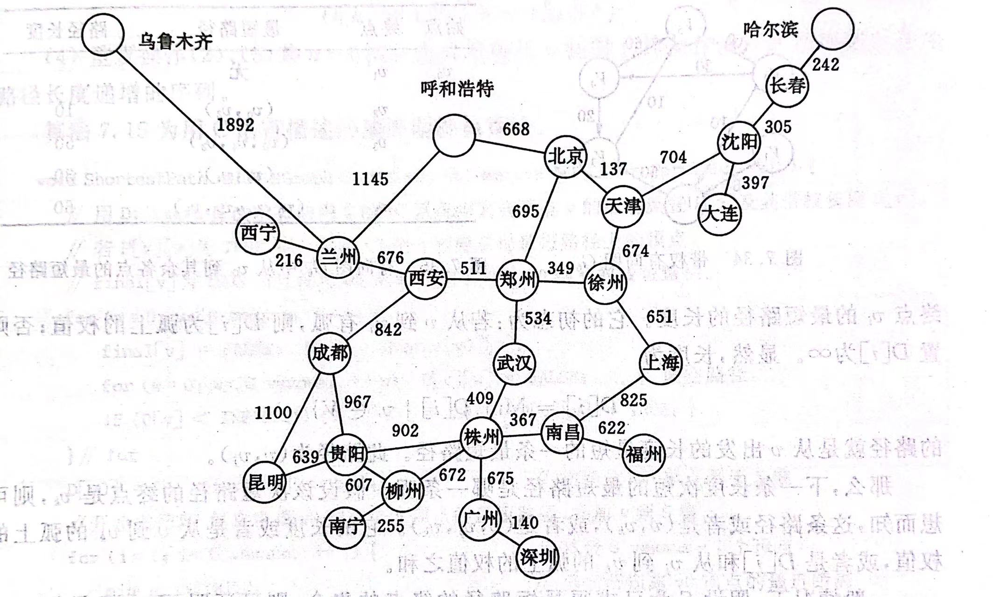

#说明手册

欢迎使用升级版12306
本程序将为您规划最便利、最实惠的出行路线
程序开始运行时，会有12345五种选项对应五种功能
您可以根据自己的需求选择不同的功能
若您对它们各自的功能尚不熟悉，请阅读以下说明

本程序根据全国交通网络，在30座城市中设立了800余条火车线路和飞机航班
每一条火车线路与飞机航班都有专属编号，为“XAABBCC”：
- X为T或F，T表示火车，F表示飞机
- AA表示始发站城市编号
- BB表示终点站城市编号
- CC表示相同城市间列车/航班序号

初始情况下，30座城市的交通连接情况为：

您可以选择`选项1`来查看初始的火车线路，也可以选择`选项2`来查看初始的飞机航班
由于列车/航班时刻表过大，您可通过翻页功能对其进行查看
当然，为了更方便地查看线路时刻表，您也可以退出程序，在**火车线路合集.txt**与**飞机航班合集.txt**两个同步文件中查看

在初始30座城市和800余条线路的基础上，您可以按照个人意愿增加城市/线路
您可以选择`选项3`来修改火车线路，也可以选择`选项4`来修改飞机航班
无论是修改火车线路还是飞机航班，您都可以选择**增加**或**删除**两种功能
- 若要增加线路，您需要按照提示依次输入始发站、终点站、起始时间、终止时间、票价。程序会自动生成线路编号并保存至线路表
- 若要删除线路，您只需输入编号，系统便会为您删除

本程序的核心功能是进行路线规划
您可以选择`选项5`来规划最便利、最实惠的路线
根据出行工具，您可以选择火车或飞机
然后您需要输入始发地和目的地
程序会为您规划出**乘坐时间最短**、**花费最少**、**中转次数最少**三种最优方案
您可以根据自己的喜好从中进行选择

希望本程序能为您的出行提供便利
祝您平安出行，旅途愉快！