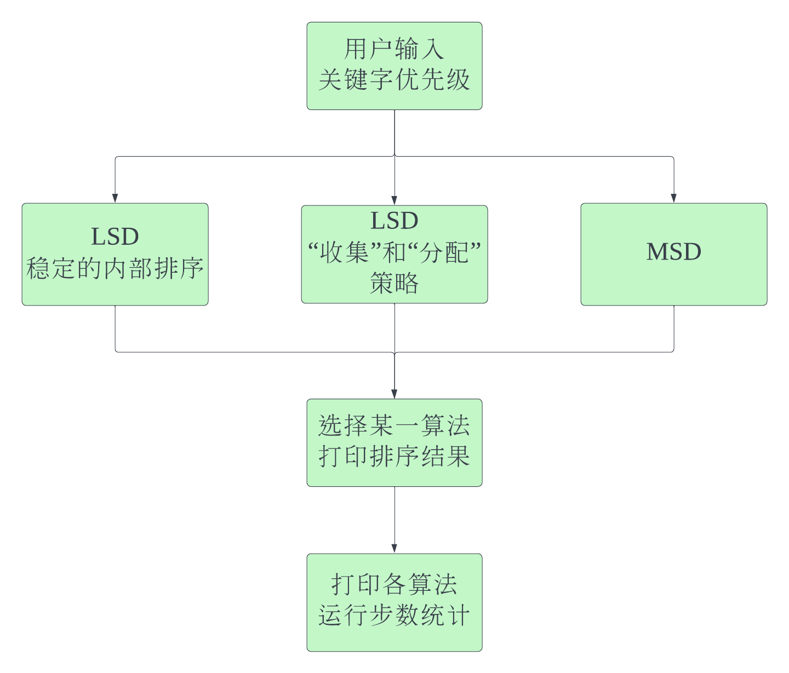

# 整体构想

**详细的数据结构和各主要函数的定义已经在头文件[SortByMultipleKeywords.h](SortByMultipleKeywords.h)中实现。**

- 获取关键字优先级
- 三种排序算法
  - LSD，稳定的内部排序法
  - LSD，“分配”和“收集”策略
  - MSD
- 打印任一排序结果
- 打印算法性能统计

# 数据结构

- 记录类型 `RcdType`
- 顺序表，用于LSD稳定的内部排序和MSD  `SqList`
- 链表，用于LSD“分配”和“收集”策略

## 规范（暂行）

1. 顺序表第一个记录`rcd[0]`没有信息，可作为排序时备用（如插入排序的监视哨）。
2. 链表使用头结点，头结点的下一个节点是首结点，从首结点开始存放信息。

# 执行流程

# 代码文件

- SortByMultipleKeywords.h，头文件
- SortByMultipleKeywords.c，主流程
  - GetOrder.c，让用户指定关键字的优先级
  - GenerateData.c，链表、顺序表的操作，实现初始化由随机数产生的链表和顺序表
  - LSDStable.c，LSD-稳定的内部排序
  - LSDDistr.c，LSD-“分配”和“收集”策略
  - MSD.c，MSD法

# 要求

- 实现LSD
  - 稳定的内部排序法
  - “分配”和收集的方法
    - 比较两种策略的时间花销（计算、输出程序执行时间）
- （选做）实现MSD
- （选做）比较LSD与MSD的时间开销