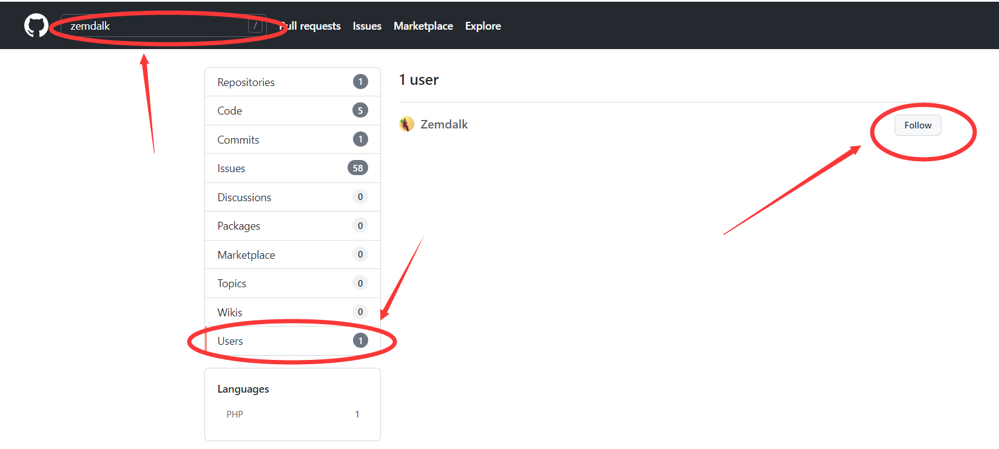
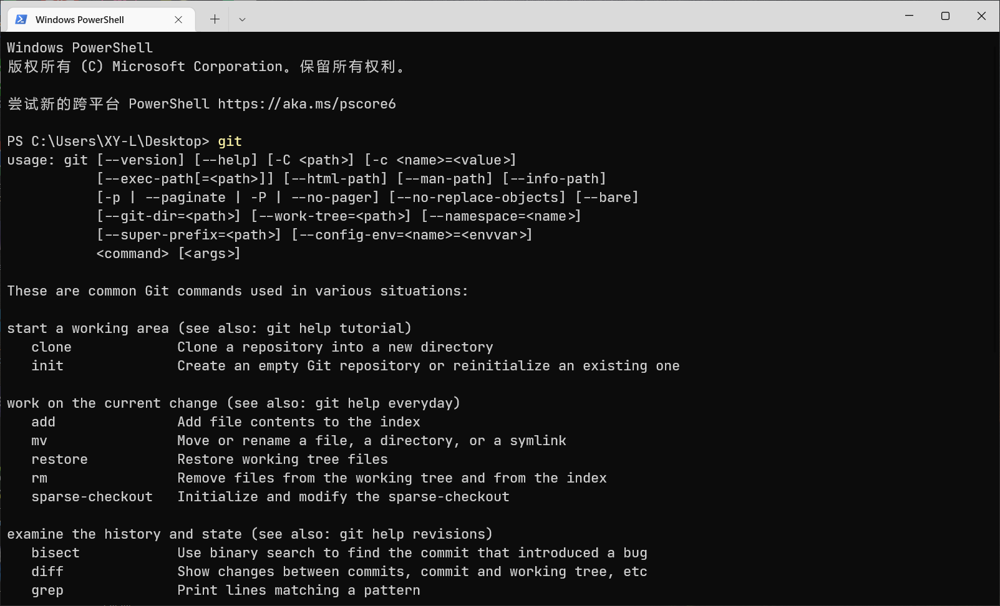
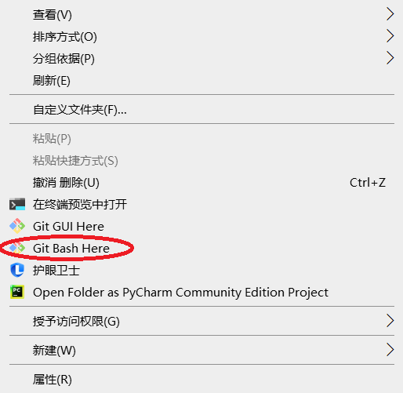
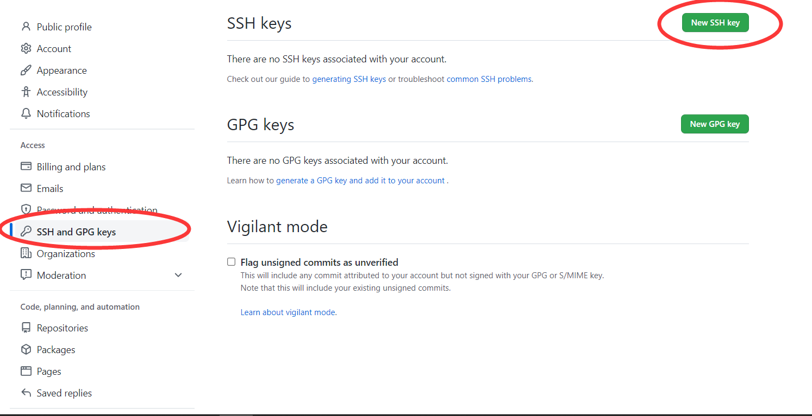
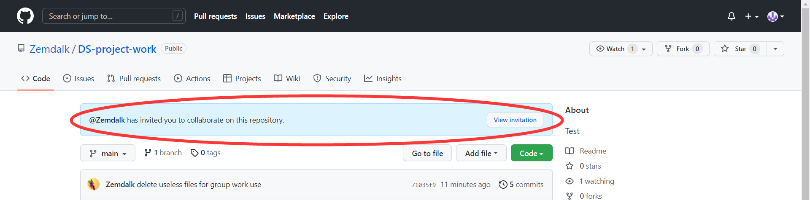

使用GitHub进行版本管理，3个人的小团队可能帮助没那么大（当然也是有帮助的），但是以后搞很多很多人的项目就有明显的优势了。git的基本操作大家在计组实验课上已经很熟练了，所以相对就轻松很多了。进入正题。

# 1. 创建一个GitHub账号

GitHub网址：[https://github.com/](https://github.com/)，点击右上角Sign Up就可以注册账号，按照导引一步一步来就行（最好是起个英文名，避免潜在的麻烦），邮箱可以用UCAS邮箱也可以用自己的，但是别忘了用什么邮箱注册的，之后配置Git还要用到。

请大家创建好账号后follow我一下，便于我邀请大家加入合作仓库，见下图（我的名字是Zemdalk）：



# 2. 下载安装Git

使用Git进行仓库的管理，在计组实验课上已经使用过了，所以如果你想用虚拟机上的Linux系统，它是自带Git的，就不需要下载。如果你要用windows系统，而且你的电脑上没有Git的话，就下载安装一个，下载链接：[https://git-scm.com/downloads](https://git-scm.com/downloads)，下载好之后打开exe文件，按照导引一步一步安装即可。

在cmd下键入命令

``` shell
git
```

如果出现了类似于下图的一串东西，就说明安装成功。



# 3.配置Git的用户名和邮箱

如果不确定自己之前有没有配置过用户名和邮箱，可以在cmd下输入

``` shell
git config --global --list
```

来查看，如果输出信息中`user.name`和`user.email`没有值的话，就说明没有配置，请继续看下面的内容，如果配置了可以直接进入步骤4。

还是在原来的cmd窗口下，输入

``` shell
git config --global user.name "这里是你的用户名"
```

及

``` shell
git config --global user.email "这里是你的邮箱"
```

来配置，记得将上面两条指令的引号里面的内容换成你在GitHub上注册的用户名和邮箱。

# 4. 使用SSH管理远程仓库

因为国内某些<del>懂得都懂的</del>原因，使用http来访问GitHub比较慢甚至会连接不上、连接超时，所以我们就使用SSH吧，虽然配置稍微麻烦点儿。如果你已经配置好了SSH key并且添加到了你的GitHub账户上，这一步可以跳过。

进入C盘，你的用户路径下（比如我的是`C:\Users\XY-L`），右键单击，选择下拉菜单中的`Git Bash Here`：



在弹出的窗口中键入下面的指令：

``` shell
ssh-keygen -t rsa -C "这里换上你的邮箱"
```

回车后会询问你ssh key生成的路径、是否需要密码，不需要的话直接留空回车即可。（路径用默认的就行，密码倒是可以写一个，安全嘛，当然不写也行）

生成之后你会看到多了一个名称为`.ssh`的文件夹，打开它，看到`id_rsa.pub`文件，右键选择用记事本打开这个文件，然后复制它的**全部**内容。

复制完成之后打开你的GitHub，点右上角你的头像，选择`Settings`，然后在左边栏找到`SSH and GPG keys`，点开后选择右上角的`New SSH key`，如下图所示：



在`Title`中随便写一个你喜欢的名字（相当于你对现在这个SSH key的备注）。然后在`Key`中粘贴你刚才复制的`id_rsa.pub`里面的内容。最后点击按钮`Add SSH key`。

**完成了以上工作，等我邀请你合作管理仓库，邀请之后我会告诉你一声，然后请继续下面的步骤。**

# 5. 克隆本次项目仓库，用Git进行管理

仓库地址：[https://github.com/Zemdalk/DS-project-work](https://github.com/Zemdalk/DS-project-work)

如果你还没接受邀请，打开上面的链接之后你会看到这一行提示：



点击`View invitation`，选择`Accept invatation`即可。然后克隆这个仓库，到你想要以后写代码的文件夹底下，右键单击-`Git Bash Here`，在Git窗口下执行命令：

``` shell
git clone git@github.com:Zemdalk/DS-project-work.git
```

然后你就会发现当前文件夹下面出现了一个名为`DS-project-work`的文件夹，你可以编辑里面的文件啦，就像计组实验课干的事情一样。

每次修改之前，请一定确保先用git pull来更新本地的仓库。【本地仓库：通俗地理解就是你这个`DS-project-work`文件夹；远程仓库：GitHub上的仓库】。在`DS-project-work`文件夹中git bash here，打开窗口，用命令

``` shell
git pull
```

来更新。

修改完代码之后，用

``` shell
git add .
```

来上传修改（add后面用`.`表示上传全部被修改的文件，是一种省略的写法，计组实验课当然也可以这样写），用

``` shell
git commit
```

来撰写commit message，用

``` shell
git push
```

来把你的修改推送到GitHub上的远程仓库中，下次你或者别人pull的时候，pull下来的就是你更新后的内容啦。这些计组实验课都讲过，不赘述。

大概就是这么多了，有问题再和我交流。